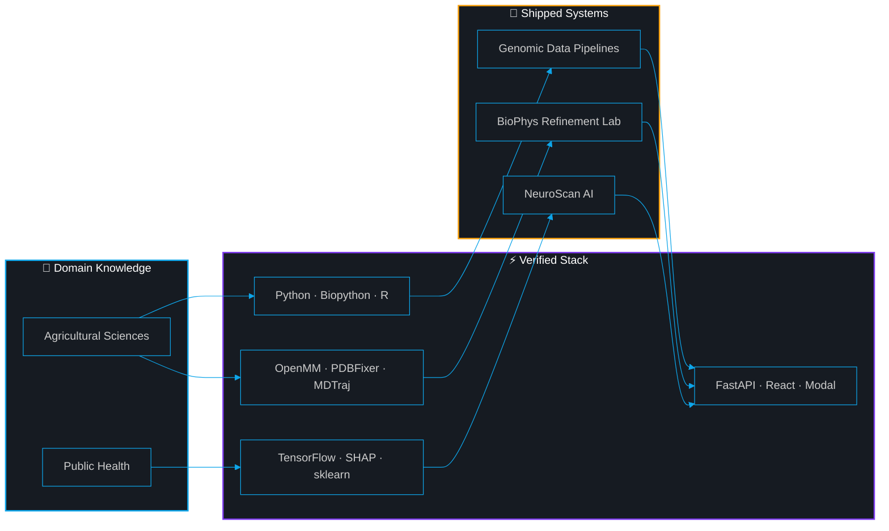

<!-- ══════════════════════════════════════════════════════════════ -->
<!-- ANIMATED BIO-TECH HEADER                                      -->
<!-- ══════════════════════════════════════════════════════════════ -->

  

&nbsp;

&nbsp;

&nbsp;

&nbsp;

  

##  `> whoami`

> First-year undergraduate at the **Faculty of Agriculture** (Alexandria, Egypt). I build and deploy **full-stack AI systems** — from protein structure refinement backends to explainable tumor classifiers — and publish research preprints on Zenodo.
>
> **Accepted into [GCI World 2026](https://gci.t.u-tokyo.ac.jp/)** at the **Matsuo Laboratory, The University of Tokyo** — a globally competitive deep learning research program.
>
> *I'm a student who ships working systems, breaks real deployment bugs, and learns in public.*

##  `> verified_lab_tools`

<!-- ═══════════════════════════════════════════════════════════════ -->
<!-- ZERO-HALLUCINATION: Every badge traced to a source file.      -->
<!-- ═══════════════════════════════════════════════════════════════ -->

<table width="100%">
<tr>
<td width="50%" valign="top">

 

> ### ⚡ Languages
>
> 
> 
> 
> -7C3AED?style=for-the-badge&logo=r&logoColor=white&labelColor=0D1117)
>
> ✅ API.py · data.ts · tsconfig.json · portfolio data.ts

 

</td>
<td width="50%" valign="top">

 

> ### 🧠 Machine Learning & Data
>
> 
> 
> 
> 
> 
> 
>
> ✅ requirements.txt · API.py · portfolio data.ts

 

</td>
</tr>
<tr>
<td width="50%" valign="top">

 

> ### 🧬 Bioinformatics & Structural Biology
>
> 
> 
> 
> 
> 
>
> ✅ minimization.py · pdb_prep.py · metrics.py · modal_app.py

 

</td>
<td width="50%" valign="top">

 

> ### 🏗️ Full-Stack & Infrastructure
>
> 
> 
> 
> 
> 
> 
> 
> 
>
> ✅ package.json (×3) · Dockerfile · modal_app.py

 

</td>
</tr>
</table>

##  `> deployed_systems`

<table width="100%">
<tr>
<td width="50%" valign="top">

 

### 🧬 [BioPhys Refinement Lab](https://github.com/HassanAhmed2Ha/biophys-refinement-lab)

 

> **What it does →** Takes protein structures (from ESMFold API or uploaded PDB files), repairs their topology with PDBFixer, and runs **OpenMM energy minimization** with the AMBER14 force field to produce stable conformations.
>
> **Why it matters →** AI-predicted structures contain steric clashes and unphysical energies. This pipeline fixes them for downstream research use.

 

&nbsp;🔬 <b>Architecture Deep-Dive (from actual code)</b>

 

**`modal_app.py`** — Serverless GPU Backend:
- FastAPI on Modal with custom two-layer CORS middleware
- Async polling: `POST /` returns `job_id` → GPU worker runs in background → `GET /status/{job_id}` polls
- Configured for `gpu="A10G"`, `memory=4096` (line 75)
- Calls ESMFold API (`api.esmatlas.com`) for sequence→structure folding (line 103)

**`pdb_prep.py`** — Two-Pass Topology Repair:
- Pass 1: Strip non-standard residues (UNK) and heterogens using PDBFixer + OpenMM Modeller
- Pass 2: Reload cleaned structure, detect chain breaks, add terminal caps and hydrogens at pH 7.4
- Critical ordering: deleting residues AFTER `addMissingAtoms()` creates dangling bonds

**`minimization.py`** — Energy Minimization:
- OpenMM with AMBER14 + GBn2 implicit solvent
- Harmonic restraints on C-alpha backbone atoms to preserve fold
- Platform auto-detection: CUDA → OpenCL → CPU fallback
- Capped at 100 iterations to prevent HTTP timeouts

**`metrics.py`** — Quality Metrics:
- pLDDT extraction from B-factor column
- C-alpha RMSD via MDTraj

**Frontend** — React 18 + Vite + Tailwind + Framer Motion + Axios

 

 

&nbsp;

 

</td>
<td width="50%" valign="top">

 

### 🧠 [NeuroScan AI](https://github.com/HassanAhmed2Ha/NeuroScan-AI)

 

> **What it does →** Accepts 5 clinical tumor measurements, returns a **malignant/benign prediction** with confidence, and generates **SHAP explanations** showing which features drove the decision.
>
> **Why it matters →** Most ML projects stop at a notebook. This is a **fully deployed system** — model → API → explainability → frontend.

 

&nbsp;🔬 <b>Architecture Deep-Dive (from actual code)</b>

 

**`API.py`** — Model & Explainability:
- TensorFlow/Keras Sequential: `Input(5) → Dense(32) → Dense(16) → Dense(8) → Dense(1, sigmoid)`
- StandardScaler persisted via `joblib` — fixed the critical **"always-predicts-malignant" bug** caused by missing scaler at inference
- GPU explicitly disabled: `CUDA_VISIBLE_DEVICES = '-1'` (CPU deployment)

**SHAP Integration** (lines 74-87):
- `KernelExplainer` with lazy initialization (built once on first request)
- `nsamples=40` for real-time response speed
- Returns per-feature attribution values with every prediction

**Infrastructure:**
- Backend: FastAPI + Uvicorn in Docker (`python:3.10`)
- Frontend: React 18 + Vite + Tailwind CSS + Framer Motion
- Deployed: HuggingFace Spaces (backend) + Vercel (frontend)

**`requirements.txt`:**
`fastapi · uvicorn · tensorflow-cpu · numpy · pydantic · joblib · scikit-learn · shap`

 

 

&nbsp;

 

</td>
</tr>
<tr>
<td colspan="2">

 

### 🌐 [Open-Source Portfolio Template](https://github.com/HassanAhmed2Ha/Hassan-Ahmed-Portfolio)

> *Bilingual (EN/AR) portfolio for students and researchers — fork it, edit `data.ts`, deploy in minutes.*
>
> React 18 · TypeScript · Vite · EmailJS · Vercel

&nbsp;

 

</td>
</tr>
</table>

##  `> research_pipeline`

##  `> github_lab_stats`

<!-- Trophies -->

  

<!-- Bento Stats Grid -->
<table width="100%">
<tr>
<td width="50%" align="center">

</td>
<td width="50%" align="center">

</td>
</tr>
</table>

 

<!-- Streak -->

  

<!-- Activity Graph -->

##  `> credentials`

<table width="100%">
<tr>
<td width="50%" valign="top">

 

&nbsp;🎓 <b>Programs & Fellowships</b>

 

> | Program | Organization |
> |:--|:--|
> | 🇯🇵 **GCI World 2026** — Deep Learning | Matsuo Lab, UTokyo |
> | 🇪🇺 **Erasmus+ Mentors Academy** | New Regeneration Project (EU) |
> | 🚀 **Galactic Problem Solver** | NASA Space Apps Challenge |
> | 🤖 **Gemini Student Ambassador** | BasharSoft / Google |
> | 🔬 **Research Cohort** | Misr El Kheir Foundation |
> | 🧠 **Data & Research Team** | Neuroverse Youth Power |
> | 🌍 **Climate Ambassador** | GreenAura |
> | 👶 **Youth Team Leader** | Save the Children Intl. |
> | 🏥 **STEM Scholar** | MedSTEMPowered |

✅ Source: portfolio data.ts lines 30-122

 

</td>
<td width="50%" valign="top">

 

&nbsp;📜 <b>Certifications</b>

 

> | Certificate | Issuer | Date |
> |:--|:--|:--|
> | NVIDIA DLI: Generative AI | ITI | Feb 2026 |
> | Statistics for Genomic Data Science | Johns Hopkins | Dec 2025 |
> | Intro to Genomic Technologies | Johns Hopkins | Dec 2025 |
> | Python for Genomic Data Science | Johns Hopkins | Dec 2025 |
> | Data Science: R Basics | HarvardX | 2025 |
> | Python Basics for Data Science | IBM | Oct 2025 |
> | Data Analytics Basics | IBM | Oct 2025 |

✅ Source: portfolio data.ts lines 124-193

 

</td>
</tr>
</table>

 

&nbsp;📄 <b>Research Publications (Zenodo Preprints)</b>

 

<table width="100%">
<tr>
<td width="33%" align="center">

 

> **🌊 Environmental Health**
>
> Chemical Analysis of Water Pollution and Its Impact on Public Health
>
> 

 

</td>
<td width="33%" align="center">

 

> **☄️ Risk Modeling**
>
> Integrated Framework for Asteroid Impact Risk Assessment
>
> 

 

</td>
<td width="33%" align="center">

 

> **🧠 AI Ethics**
>
> AI Impact on Human Cognitive Autonomy
>
> 

 

</td>
</tr>
</table>

✅ Source: portfolio data.ts lines 254-278

##  `> connect`

 

Open to **research collaborations**, **scholarships**, and **open-source fellowships** in:

 

&nbsp;

&nbsp;

&nbsp;

  

&nbsp;

&nbsp;

&nbsp;

&nbsp;

  

*A first-year student building real systems at the intersection of biology and computation.*

**Alexandria, Egypt 🇪🇬**

 

