 

# Hassan Ahmed

**Computational Biologist** · **ML/DL Engineer** · **Full-Stack Bioinformatics Architect**

 

<!-- ── HERO BADGES ── Unified dark theme -->

  

## `> whoami`

> *"Biology generates the hypotheses. Computation validates them. Engineering deploys them at scale."*

Undergraduate researcher at the **Faculty of Agriculture**, building **production-grade, GPU-accelerated bioinformatics pipelines** — from protein structure refinement on **NVIDIA A10G** GPUs to explainable tumor classification on the edge.

My agricultural training isn't separate from computation — **it's the domain expertise** that turns generic ML into scientifically rigorous instruments for drug discovery, antimicrobial resistance tracking, and environmental health.

**Accepted: [GCI World 2026](https://gci.t.u-tokyo.ac.jp/) — Matsuo Laboratory, The University of Tokyo** — deep learning, generative AI, and computational systems design.

## `> tech_stack`

<!-- ═══════════════════════════════════════════════════════════════════ -->
<!-- BENTO BOX: Skills Grid — 2×2 layout with unified dark badges     -->
<!-- ═══════════════════════════════════════════════════════════════════ -->

<table width="100%">
<tr>
<td width="50%" valign="top">

### &nbsp;&nbsp;⚡ Languages

 

&nbsp;&nbsp;

</td>
<td width="50%" valign="top">

### &nbsp;&nbsp;🧠 ML / Deep Learning

 

&nbsp;&nbsp;

</td>
</tr>
<tr>
<td width="50%" valign="top">

### &nbsp;&nbsp;🧬 Bioinformatics

 

&nbsp;&nbsp;

</td>
<td width="50%" valign="top">

### &nbsp;&nbsp;🏗️ Stack & Infra

 

&nbsp;&nbsp;

</td>
</tr>
</table>

## `> featured_projects`

<!-- ═══════════════════════════════════════════════════════════════════ -->
<!-- BENTO BOX: Featured Projects — Side-by-side cards                -->
<!-- ═══════════════════════════════════════════════════════════════════ -->

<table width="100%">
<tr>
<td width="50%" valign="top">

### 🧬 [BioPhys Refinement Lab](https://github.com/HassanAhmed2Ha/biophys-refinement-lab)

*GPU-Accelerated Protein Structure Refinement*

 

**The Problem →** AlphaFold/ESMFold produce structures with **>50,000 kJ/mol** unphysical energy — unusable for drug docking.

**The Solution →** AMBER14 force field + restrained C-alpha minimization on **NVIDIA A10G**, wrapped in an async polling architecture that handles 10-min GPU jobs over HTTP.

**Key Innovation →** Two-pass PDBFixer pipeline that robustly repairs experimental PDB defects (UNK residues, missing terminal caps, broken chains).

 

| Metric | Value |
|:--|:--|
| Repair Rate | **98%** |
| Energy Reduction | **>70,000 kJ/mol** |
| Backbone RMSD | **< 0.5 A** |
| GPU Speedup | **~85% vs CPU** |

 

 

</td>
<td width="50%" valign="top">

### 🧠 [NeuroScan AI](https://github.com/HassanAhmed2Ha/NeuroScan-AI)

*Explainable Deep Learning for Tumor Diagnosis*

 

**The Problem →** Clinical ML models are **black boxes** — clinicians can't trust predictions they can't explain.

**The Solution →** End-to-end breast tumor classification with **SHAP-based feature attribution** on every single prediction, exposing which clinical features drove the diagnosis.

**Key Innovation →** Solved the critical "always-predicts-malignant" deployment bug caused by missing StandardScaler consistency between training and inference environments.

 

| Metric | Value |
|:--|:--|
| Prediction | **Real-time** |
| Explainability | **Per-feature SHAP** |
| Deployment | **HuggingFace + Vercel** |
| Scaler Fix | **Critical bug resolved** |

 

 

</td>
</tr>
</table>

## `> research_vision`

```mermaid
%%{init: {'theme': 'dark', 'themeVariables': {'primaryColor': '#7C3AED', 'primaryTextColor': '#C9D1D9', 'primaryBorderColor': '#0EA5E9', 'lineColor': '#0EA5E9', 'secondaryColor': '#0D1117', 'tertiaryColor': '#161B22', 'background': '#0D1117', 'mainBkg': '#161B22', 'nodeBorder': '#0EA5E9', 'clusterBkg': '#0D1117', 'clusterBorder': '#7C3AED', 'edgeLabelBackground': '#0D1117'}}}%%
flowchart LR
    subgraph DOMAIN["🌾 Agricultural Foundation"]
        A["Plant Genomics"]
        B["Crop Pathology"]
        C["Soil Chemistry"]
        D["Food Safety"]
    end

    subgraph COMPUTE["⚡ Computational Engine"]
        E["Biopython / R"]
        F["ML Models"]
        G["Data Science"]
        H["Neo4j / ETL"]
    end

    subgraph OUTPUT["🔬 Research Output"]
        I["Genomic Pipelines"]
        J["AMR Prediction"]
        K["Health Analytics"]
        L["Knowledge Graphs"]
    end

    A --> E --> I
    B --> F --> J
    C --> G --> K
    D --> H --> L

    I --> M
    J --> M
    K --> M
    L --> M

    M{"💊 Drug Discovery\n OpenMM | CUDA | AlphaFold"}

    style DOMAIN fill:#161B22,stroke:#0EA5E9,stroke-width:2px
    style COMPUTE fill:#161B22,stroke:#7C3AED,stroke-width:2px
    style OUTPUT fill:#161B22,stroke:#0EA5E9,stroke-width:2px
    style M fill:#7C3AED,stroke:#0EA5E9,stroke-width:2px,color:#ffffff
```

<!-- ═══════════════════════════════════════════════════════════════════ -->
<!-- MERMAID: Research Pipeline — Replaces the ugly ASCII art          -->
<!-- ═══════════════════════════════════════════════════════════════════ -->

 

**Agriculture is the domain. Computation is the method. Drug discovery is the mission.**

## `> github_analytics`

<!-- ═══════════════════════════════════════════════════════════════════ -->
<!-- BENTO BOX: GitHub Stats — 2-column layout                        -->
<!-- ═══════════════════════════════════════════════════════════════════ -->

<table width="100%">
<tr>
<td width="50%" align="center">

</td>
<td width="50%" align="center">

</td>
</tr>
</table>

 

  

## `> publications`

<table width="100%">
<tr>
<td width="33%" align="center">

**Environmental Health**

Chemical Analysis of Water Pollution & Public Health Impact

 

</td>
<td width="33%" align="center">

**Risk Modeling**

Integrated Framework for Asteroid Impact Risk Assessment

 

</td>
<td width="33%" align="center">

**AI Ethics**

AI Impact on Human Cognitive Autonomy

 

</td>
</tr>
</table>

## `> credentials`

<!-- ═══════════════════════════════════════════════════════════════════ -->
<!-- BENTO BOX: Credentials — 2-column compact layout                 -->
<!-- ═══════════════════════════════════════════════════════════════════ -->

<table width="100%">
<tr>
<td width="50%" valign="top">

### &nbsp;&nbsp;🎓 Programs & Fellowships
  
 

&nbsp;&nbsp;🇯🇵 **GCI World 2026** — Matsuo Lab, UTokyo

&nbsp;&nbsp;🇪🇺 **Erasmus+ Mentors Academy** — EU

&nbsp;&nbsp;🚀 **Galactic Problem Solver** — NASA

&nbsp;&nbsp;🤖 **Gemini Student Ambassador** — Google

&nbsp;&nbsp;🔬 **Research Cohort** — Misr El Kheir Foundation

&nbsp;&nbsp;🌍 **Climate Ambassador** — GreenAura

&nbsp;&nbsp;👶 **Youth Team Leader** — Save the Children

&nbsp;&nbsp;🏥 **STEM Scholar** — MedSTEMPowered

</td>
<td width="50%" valign="top">

### &nbsp;&nbsp;📜 Certifications

 

&nbsp;&nbsp;🎮 **NVIDIA DLI** — Generative AI *(ITI, 2026)*

&nbsp;&nbsp;🧬 **Genomic Data Science ×3** — Johns Hopkins

&nbsp;&nbsp;📊 **Data Science: R** — HarvardX

&nbsp;&nbsp;🐍 **Python for Data Science** — IBM

&nbsp;&nbsp;📈 **Data Analytics Basics** — IBM

</td>
</tr>
</table>

## `> connect`

 

Actively seeking **research scholarships**, **open-source fellowships**, and **collaborations** in:

 

`Computational Drug Discovery` · `AI for Public Health` · `Agricultural Genomics` · `Structural Bioinformatics`

  

&nbsp;

&nbsp;

&nbsp;

&nbsp;

  

 

*"We are building the Motherboard that makes the AI Processors useful for real-world Drug Discovery."*

**From Alexandria, Egypt — Engineering Biology, One Pipeline at a Time.**

 

