<!-- ══════════════════════════════════════════════════════════════ -->
<!-- DYNAMIC HEADER BANNER                                        -->
<!-- ══════════════════════════════════════════════════════════════ -->

  

 

## `> whoami`

First-year undergraduate at the **Faculty of Agriculture** (Alexandria, Egypt), building full-stack AI systems and computational biology pipelines. I work at the intersection of **bioinformatics**, **data science**, and **public health** — applying data-driven approaches to problems that matter.

**Accepted into [GCI World 2026](https://gci.t.u-tokyo.ac.jp/)** at the **Matsuo Laboratory, The University of Tokyo** — a globally competitive deep learning research program.

> *I'm a student who ships real systems, writes research preprints, and learns in public.*

## `> skills`

<!-- ═══════════════════════════════════════════════════════════════ -->
<!-- Every badge below is verified from: requirements.txt,         -->
<!-- package.json, Python imports, or portfolio data.ts             -->
<!-- ═══════════════════════════════════════════════════════════════ -->

<table width="100%">
<tr>
<td width="50%" valign="top">

### &nbsp;&nbsp;⚡ Languages

&nbsp;&nbsp;

-0D1117?style=flat-square&logo=r&logoColor=0EA5E9)

Sources: API.py, pdb_prep.py, data.ts, tsconfig.json, portfolio data.ts

</td>
<td width="50%" valign="top">

### &nbsp;&nbsp;🧠 Machine Learning & Data

&nbsp;&nbsp;

Sources: requirements.txt, API.py imports, portfolio data.ts

</td>
</tr>
<tr>
<td width="50%" valign="top">

### &nbsp;&nbsp;🧬 Bioinformatics & Physics

&nbsp;&nbsp;

Sources: minimization.py, pdb_prep.py, metrics.py, modal_app.py

</td>
<td width="50%" valign="top">

### &nbsp;&nbsp;🏗️ Web, Infra & DevOps

&nbsp;&nbsp;

Sources: package.json (×3), Dockerfile, modal_app.py, vercel.json

</td>
</tr>
</table>

## `> projects`

<table width="100%">
<tr>
<td width="50%" valign="top">

### 🧬 [BioPhys Refinement Lab](https://github.com/HassanAhmed2Ha/biophys-refinement-lab)

*Physics-Based Protein Structure Refinement*

 

**What it does →** Takes AI-predicted or experimental protein structures, runs them through a **GPU-accelerated molecular dynamics** pipeline (OpenMM + AMBER14 force field), and produces **thermodynamically stable conformations** for downstream research.

**Why it matters →** AI models like ESMFold produce structures with steric clashes and unphysical energies. This platform makes them usable.

&nbsp;🔍 <b>Technical Details (from actual code)</b>

 

**Backend** — `modal_app.py`:
- FastAPI gateway on Modal serverless with custom two-layer CORS middleware
- Async polling architecture: `POST /` returns `job_id` instantly → GPU worker runs in background → `GET /status/{job_id}` polls results
- GPU worker: `gpu="A10G"`, `memory=4096` (line 75 of `modal_app.py`)

**Physics Engine** — `minimization.py`:
- OpenMM energy minimization with AMBER14 + GBn2 implicit solvent
- Harmonic positional restraints on C-alpha backbone atoms
- Platform auto-detection: CUDA → OpenCL → CPU fallback

**Topology Repair** — `pdb_prep.py`:
- Two-pass PDBFixer pipeline: Pass 1 strips non-standard residues (UNK), Pass 2 reloads and repairs terminal caps
- Critical: deleting residues AFTER `addMissingAtoms()` creates dangling bonds — order matters

**Metrics** — `metrics.py`:
- pLDDT extraction from PDB B-factor column
- C-alpha RMSD computation via MDTraj

**Frontend** — React 18 + Vite + Tailwind CSS + Framer Motion + Axios + 3Dmol.js

 

</td>
<td width="50%" valign="top">

### 🧠 [NeuroScan AI](https://github.com/HassanAhmed2Ha/NeuroScan-AI)

*Explainable Breast Cancer Diagnosis*

 

**What it does →** Accepts 5 clinical tumor features, returns a **malignant/benign prediction** with confidence score, and generates **SHAP explanations** showing which features drove the decision.

**Why it matters →** Most ML projects stop at a notebook. This is a **full deployed system** — model → API → explainability → frontend.

&nbsp;🔍 <b>Technical Details (from actual code)</b>

 

**Model** — `API.py`:
- TensorFlow/Keras Sequential: `Input(5) → Dense(32) → Dense(16) → Dense(8) → Dense(1, sigmoid)`
- StandardScaler persisted with `joblib` — solved the critical "always-predicts-malignant" bug caused by missing scaler at inference time

**Explainability** — `API.py` lines 74-87:
- SHAP `KernelExplainer` with lazy initialization (built once on first request)
- Reduced `nsamples=40` for real-time responsiveness

**Infrastructure**:
- Backend: FastAPI + Uvicorn, containerized with `Dockerfile` (`python:3.10`)
- Frontend: React 18 + Vite + Tailwind CSS + Framer Motion
- Deployed: HuggingFace Spaces (backend) + Vercel (frontend)

**Dependencies** (from `requirements.txt`):
`fastapi`, `uvicorn`, `tensorflow-cpu`, `numpy`, `pydantic`, `joblib`, `scikit-learn`, `shap`

 

</td>
</tr>
<tr>
<td colspan="2">

### 🌐 [Open-Source Portfolio Template](https://github.com/HassanAhmed2Ha/Hassan-Ahmed-Portfolio)

*Free, bilingual (EN/AR) portfolio for students and early researchers — because digital empowerment is a right, not a luxury.*

React 18 + TypeScript + Vite + EmailJS · Fork it, edit `data.ts`, deploy in minutes.

</td>
</tr>
</table>

## `> workflow`

```mermaid
%%{init: {'theme': 'dark', 'themeVariables': {'primaryColor': '#7C3AED', 'primaryTextColor': '#C9D1D9', 'primaryBorderColor': '#0EA5E9', 'lineColor': '#0EA5E9', 'secondaryColor': '#0D1117', 'tertiaryColor': '#161B22', 'background': '#0D1117', 'mainBkg': '#161B22', 'nodeBorder': '#0EA5E9', 'clusterBkg': '#161B22', 'clusterBorder': '#7C3AED'}}}%%
flowchart LR
    subgraph BIO["🌾 Biological Domain"]
        A["Agricultural Sciences"]
        B["Public Health"]
    end

    subgraph COMPUTE["⚡ Computational Stack"]
        C["Python / Biopython / R"]
        D["TensorFlow / SHAP"]
        E["OpenMM / PDBFixer"]
        F["FastAPI / React / Modal"]
    end

    subgraph DELIVER["🔬 Deliverables"]
        G["Genomic Data Pipelines"]
        H["Explainable Medical AI\n(NeuroScan)"]
        I["Protein Refinement\n(BioPhys Lab)"]
    end

    A --> C --> G
    B --> D --> H
    A --> E --> I
    G --> F
    H --> F
    I --> F

    style BIO fill:#161B22,stroke:#0EA5E9,stroke-width:2px
    style COMPUTE fill:#161B22,stroke:#7C3AED,stroke-width:2px
    style DELIVER fill:#161B22,stroke:#0EA5E9,stroke-width:2px
```

## `> github_analytics`

  

<table width="100%">
<tr>
<td width="50%" align="center">

</td>
<td width="50%" align="center">

</td>
</tr>
</table>

 

  

## `> credentials`

<table width="100%">
<tr>
<td width="50%" valign="top">

&nbsp;🎓 <b>Programs & Fellowships</b>

 

| Program | Organization |
|:--|:--|
| 🇯🇵 **GCI World 2026** — Deep Learning | Matsuo Lab, UTokyo |
| 🇪🇺 **Erasmus+ Mentors Academy** | New Regeneration Project (EU) |
| 🚀 **Galactic Problem Solver** | NASA Space Apps Challenge |
| 🤖 **Gemini Student Ambassador** | BasharSoft / Google |
| 🔬 **Research Cohort** | Misr El Kheir Foundation |
| 🧠 **Data & Research Team** | Neuroverse Youth Power |
| 🌍 **Climate Ambassador** | GreenAura |
| 👶 **Youth Team Leader** | Save the Children Intl. |
| 🏥 **STEM Scholar** | MedSTEMPowered |

Source: portfolio data.ts lines 30-122

</td>
<td width="50%" valign="top">

&nbsp;📜 <b>Certifications</b>

 

| Certificate | Issuer | Date |
|:--|:--|:--|
| NVIDIA DLI: Generative AI | ITI | Feb 2026 |
| Statistics for Genomic Data Science | Johns Hopkins | Dec 2025 |
| Intro to Genomic Technologies | Johns Hopkins | Dec 2025 |
| Python for Genomic Data Science | Johns Hopkins | Dec 2025 |
| Data Science: R Basics | HarvardX | 2025 |
| Python Basics for Data Science | IBM | Oct 2025 |
| Data Analytics Basics | IBM | Oct 2025 |

Source: portfolio data.ts lines 124-193

</td>
</tr>
</table>

 

&nbsp;📄 <b>Research Publications (Zenodo Preprints)</b>

 

<table width="100%">
<tr>
<td width="33%" align="center">

**Environmental Health**

Chemical Analysis of Water Pollution and Its Impact on Public Health

</td>
<td width="33%" align="center">

**Risk Modeling**

Integrated Framework for Asteroid Impact Risk Assessment

</td>
<td width="33%" align="center">

**AI Ethics**

AI Impact on Human Cognitive Autonomy

</td>
</tr>
</table>

Source: portfolio data.ts lines 254-278

## `> connect`

 

Open to **research collaborations**, **scholarships**, and **open-source fellowships** in:

`Bioinformatics` · `Data Science for Public Health` · `Computational Biology` · `Explainable AI`

  

&nbsp;

&nbsp;

&nbsp;

&nbsp;

  

