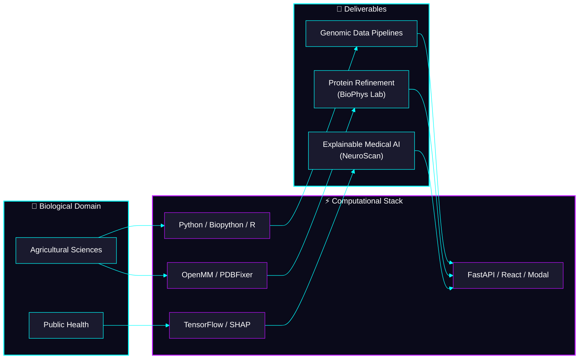

<!-- ══════════════════════════════════════════════════════════════ -->
<!-- ANIMATED NEON HEADER                                          -->
<!-- ══════════════════════════════════════════════════════════════ -->

<!-- Bio-Tech DNA animated GIF for immediate motion -->

  
 

  

<!-- ── HERO BADGES — Neon glow colors ── -->

&nbsp;

&nbsp;

&nbsp;

&nbsp;

  

 

 

##  `> whoami`

 

> 🧬 First-year undergraduate at the **Faculty of Agriculture** (Alexandria, Egypt), building full-stack AI systems and computational biology pipelines. I work at the intersection of **bioinformatics**, **data science**, and **public health** — applying data-driven approaches to problems that matter.
>
> 🇯🇵 **Accepted into [GCI World 2026](https://gci.t.u-tokyo.ac.jp/)** at the **Matsuo Laboratory, The University of Tokyo** — a globally competitive deep learning research program.
>
> ✨ *I'm a student who ships real systems, writes research preprints, and learns in public.*

 

 

##  `> skills`

<!-- ═══════════════════════════════════════════════════════════════ -->
<!-- Every badge verified from: requirements.txt, package.json,    -->
<!-- Python imports, or portfolio data.ts                           -->
<!-- ═══════════════════════════════════════════════════════════════ -->

<table width="100%">
<tr>
<td width="50%" valign="top">

 

> ### &nbsp; ⚡ Languages
>
> &nbsp;
> 
> 
> -39FF14?style=for-the-badge&logo=r&logoColor=ffffff&labelColor=1a1a2e)
>
> Sources: API.py, pdb_prep.py, data.ts, tsconfig.json

 

</td>
<td width="50%" valign="top">

 

> ### &nbsp; 🧠 Machine Learning & Data
>
> &nbsp;
> 
> 
> 
> 
> 
>
> Sources: requirements.txt, API.py imports, portfolio data.ts

 

</td>
</tr>
<tr>
<td width="50%" valign="top">

 

> ### &nbsp; 🧬 Bioinformatics & Physics
>
> &nbsp;
> 
> 
> 
> 
>
> Sources: minimization.py, pdb_prep.py, metrics.py, modal_app.py

 

</td>
<td width="50%" valign="top">

 

> ### &nbsp; 🏗️ Web, Infra & DevOps
>
> &nbsp;
> 
> 
> 
> 
> 
> 
> 
>
> Sources: package.json (x3), Dockerfile, modal_app.py, vercel.json

 

</td>
</tr>
</table>

 

 

##  `> projects`

<table width="100%">
<tr>
<td width="50%" valign="top">

 

### 🧬 [BioPhys Refinement Lab](https://github.com/HassanAhmed2Ha/biophys-refinement-lab)

 

> **What it does →** Takes AI-predicted or experimental protein structures, runs them through a **GPU-accelerated molecular dynamics** pipeline (OpenMM + AMBER14 force field), and produces **thermodynamically stable conformations** for downstream research.
>
> **Why it matters →** AI models like ESMFold produce structures with steric clashes and unphysical energies. This platform makes them usable.

 

&nbsp;🔮 <b>Technical Details (from actual code)</b>

 

**Backend** — `modal_app.py`:
- FastAPI gateway on Modal serverless with custom two-layer CORS middleware
- Async polling architecture: `POST /` returns `job_id` instantly → GPU worker runs in background → `GET /status/{job_id}` polls results
- GPU worker: `gpu="A10G"`, `memory=4096` (line 75 of `modal_app.py`)

**Physics Engine** — `minimization.py`:
- OpenMM energy minimization with AMBER14 + GBn2 implicit solvent
- Harmonic positional restraints on C-alpha backbone atoms
- Platform auto-detection: CUDA → OpenCL → CPU fallback

**Topology Repair** — `pdb_prep.py`:
- Two-pass PDBFixer pipeline: Pass 1 strips non-standard residues (UNK), Pass 2 reloads and repairs terminal caps
- Critical: deleting residues AFTER `addMissingAtoms()` creates dangling bonds — order matters

**Metrics** — `metrics.py`:
- pLDDT extraction from PDB B-factor column
- C-alpha RMSD computation via MDTraj

**Frontend** — React 18 + Vite + Tailwind CSS + Framer Motion + Axios + 3Dmol.js

 

 

&nbsp;

 

</td>
<td width="50%" valign="top">

 

### 🧠 [NeuroScan AI](https://github.com/HassanAhmed2Ha/NeuroScan-AI)

 

> **What it does →** Accepts 5 clinical tumor features, returns a **malignant/benign prediction** with confidence score, and generates **SHAP explanations** showing which features drove the decision.
>
> **Why it matters →** Most ML projects stop at a notebook. This is a **full deployed system** — model → API → explainability → frontend.

 

&nbsp;🔮 <b>Technical Details (from actual code)</b>

 

**Model** — `API.py`:
- TensorFlow/Keras Sequential: `Input(5) → Dense(32) → Dense(16) → Dense(8) → Dense(1, sigmoid)`
- StandardScaler persisted with `joblib` — solved the critical "always-predicts-malignant" bug caused by missing scaler at inference time

**Explainability** — `API.py` lines 74-87:
- SHAP `KernelExplainer` with lazy initialization (built once on first request)
- Reduced `nsamples=40` for real-time responsiveness

**Infrastructure**:
- Backend: FastAPI + Uvicorn, containerized with `Dockerfile` (`python:3.10`)
- Frontend: React 18 + Vite + Tailwind CSS + Framer Motion
- Deployed: HuggingFace Spaces (backend) + Vercel (frontend)

**Dependencies** (from `requirements.txt`):
`fastapi`, `uvicorn`, `tensorflow-cpu`, `numpy`, `pydantic`, `joblib`, `scikit-learn`, `shap`

 

 

&nbsp;

 

</td>
</tr>
<tr>
<td colspan="2">

 

### 🌐 [Open-Source Portfolio Template](https://github.com/HassanAhmed2Ha/Hassan-Ahmed-Portfolio)

> *Free, bilingual (EN/AR) portfolio for students and early researchers — because digital empowerment is a right, not a luxury.*
>
> React 18 + TypeScript + Vite + EmailJS · Fork it, edit `data.ts`, deploy in minutes.

 

&nbsp;

 

</td>
</tr>
</table>

 

 

##  `> workflow`

 

 

##  `> github_analytics`

<!-- Trophies with neon theme -->

  

<!-- Stats + Languages side by side -->
<table width="100%">
<tr>
<td width="50%" align="center">

</td>
<td width="50%" align="center">

</td>
</tr>
</table>

 

<!-- Streak with neon glow colors -->

  

<!-- Activity Graph with cyberpunk glow -->

 

 

##  `> credentials`

<table width="100%">
<tr>
<td width="50%" valign="top">

 

&nbsp;🎓 <b>Programs & Fellowships</b>

 

> | Program | Organization |
> |:--|:--|
> | 🇯🇵 **GCI World 2026** — Deep Learning | Matsuo Lab, UTokyo |
> | 🇪🇺 **Erasmus+ Mentors Academy** | New Regeneration Project (EU) |
> | 🚀 **Galactic Problem Solver** | NASA Space Apps Challenge |
> | 🤖 **Gemini Student Ambassador** | BasharSoft / Google |
> | 🔬 **Research Cohort** | Misr El Kheir Foundation |
> | 🧠 **Data & Research Team** | Neuroverse Youth Power |
> | 🌍 **Climate Ambassador** | GreenAura |
> | 👶 **Youth Team Leader** | Save the Children Intl. |
> | 🏥 **STEM Scholar** | MedSTEMPowered |

Source: portfolio data.ts lines 30-122

 

</td>
<td width="50%" valign="top">

 

&nbsp;📜 <b>Certifications</b>

 

> | Certificate | Issuer | Date |
> |:--|:--|:--|
> | NVIDIA DLI: Generative AI | ITI | Feb 2026 |
> | Statistics for Genomic Data Science | Johns Hopkins | Dec 2025 |
> | Intro to Genomic Technologies | Johns Hopkins | Dec 2025 |
> | Python for Genomic Data Science | Johns Hopkins | Dec 2025 |
> | Data Science: R Basics | HarvardX | 2025 |
> | Python Basics for Data Science | IBM | Oct 2025 |
> | Data Analytics Basics | IBM | Oct 2025 |

Source: portfolio data.ts lines 124-193

 

</td>
</tr>
</table>

 

&nbsp;📄 <b>Research Publications (Zenodo Preprints)</b>

 

<table width="100%">
<tr>
<td width="33%" align="center">

 

> **🌊 Environmental Health**
>
> Chemical Analysis of Water Pollution and Its Impact on Public Health
>
> 

 

</td>
<td width="33%" align="center">

 

> **☄️ Risk Modeling**
>
> Integrated Framework for Asteroid Impact Risk Assessment
>
> 

 

</td>
<td width="33%" align="center">

 

> **🧠 AI Ethics**
>
> AI Impact on Human Cognitive Autonomy
>
> 

 

</td>
</tr>
</table>

Source: portfolio data.ts lines 254-278

 

 

##  `> connect`

 

Open to **research collaborations**, **scholarships**, and **open-source fellowships** in:

 

&nbsp;

&nbsp;

&nbsp;

  

&nbsp;

&nbsp;

&nbsp;

&nbsp;

  

<!-- ══════════════════════════════════════════════════════════════ -->
<!-- ANIMATED NEON FOOTER                                          -->
<!-- ══════════════════════════════════════════════════════════════ -->

