<!-- ══════════════════════════════════════════════════════════════ -->
<!-- COVER BANNER — Replace the URL below with your custom image -->
<!-- ══════════════════════════════════════════════════════════════ -->


<!-- ══════════════════════════════════════════════════════════════ -->
<!-- ANIMATED HEADER                                               -->
<!-- ══════════════════════════════════════════════════════════════ -->

<div align="center">

<a href="https://git.io/typing-svg"></a>

<br/>

# Hassan Ahmed

**Bioinformatics Researcher** · **Data Scientist** · **First-Year Undergraduate**

*Faculty of Agriculture — Alexandria, Egypt*

<br/>

<a href="https://gci.t.u-tokyo.ac.jp/"></a>
<a href="https://hassan-ahmed-portfolio.vercel.app"></a>
<a href="https://www.linkedin.com/in/hassan-ahmed2007"></a>
<a href="https://orcid.org/0009-0005-0306-0898"></a>
<a href="mailto:hassanahmed07.e9@gmail.com"></a>

<br/><br/>


</div>


## `> whoami`

I am a **first-year undergraduate** at the **Faculty of Agriculture**, Alexandria, Egypt, working at the intersection of **bioinformatics**, **data science**, and **public health**.

I apply data-driven approaches to real problems — from building **explainable medical AI systems** to constructing **pharmaceutical knowledge graphs** — and I document every lesson learned along the way.

**Accepted into [GCI World 2026](https://gci.t.u-tokyo.ac.jp/)** at the **Matsuo Laboratory, The University of Tokyo** — a globally recognized deep learning research program.

> *I am not a senior engineer. I am a student who ships working systems, writes research preprints, and learns in public.*


## `> skills`

<!-- ═══════════════════════════════════════════════════════════════ -->
<!-- BENTO GRID: Verified skills only — extracted from codebase,   -->
<!-- portfolio data.ts, requirements.txt, and user-stated stack    -->
<!-- ═══════════════════════════════════════════════════════════════ -->

<table width="100%">
<tr>
<td width="50%" valign="top">

### &nbsp;&nbsp;⚡ Languages

<br/>

&nbsp;&nbsp;


</td>
<td width="50%" valign="top">

### &nbsp;&nbsp;🧠 Data Science & ML

<br/>

&nbsp;&nbsp;


</td>
</tr>
<tr>
<td width="50%" valign="top">

### &nbsp;&nbsp;🧬 Bioinformatics

<br/>

&nbsp;&nbsp;


</td>
<td width="50%" valign="top">

### &nbsp;&nbsp;🏗️ Stack & Infrastructure

<br/>

&nbsp;&nbsp;


</td>
</tr>
</table>


## `> projects`

<!-- ═══════════════════════════════════════════════════════════════ -->
<!-- BENTO GRID: Featured Projects — only verified from codebase   -->
<!-- Each card has a collapsible architecture section               -->
<!-- ═══════════════════════════════════════════════════════════════ -->

<table width="100%">
<tr>
<td width="50%" valign="top">

<div align="center">

### 🧠 [NeuroScan AI](https://github.com/HassanAhmed2Ha/NeuroScan-AI)

*Explainable Breast Cancer Diagnosis System*

</div>

<br/>

**What it does →** Accepts clinical tumor features, returns a **malignant/benign prediction** with a confidence score, and uses **SHAP** to explain *why* the model made that decision.

**Why it matters →** Most ML projects stop at a trained notebook. This is a **full deployed system** — model, API, explainability, and frontend — proving that AI for healthcare must be interpretable, not just accurate.

<br/>

<details>
<summary>&nbsp;🔍 <b>Architecture & Challenges Solved</b></summary>
<br/>

**Stack:** TensorFlow/Keras · FastAPI · SHAP · React · Docker

**Deployment:** HuggingFace Spaces (backend) · Vercel (frontend)

**Key challenge solved:** The model was always predicting "Malignant" after deployment. Root cause: the `StandardScaler` used during training was not saved and reloaded for inference. The model received raw, unscaled data — completely different distributions. Fixed by persisting the scaler with `joblib` and applying it before every prediction.

**SHAP optimization:** SHAP's `KernelExplainer` is computationally expensive. Implemented lazy initialization (built once on first request) and reduced `nsamples` to 40 for real-time responsiveness without sacrificing interpretability.

```python
# The fix that made everything work
scaler = joblib.load('scaler.pkl')
scaled_data = scaler.transform(raw_data)
```

</details>

<br/>

<div align="center">

[](https://tumor-diagnosis-frontend.vercel.app)
[](https://huggingface.co/spaces/Hassan2007/tumor-diagnosis-backend)

</div>

</td>
<td width="50%" valign="top">

<div align="center">

### 💊 PharmaGene ETL & Knowledge Graph

*Drug-Gene Relationship Intelligence Platform*

</div>

<br/>

**What it does →** An ETL pipeline that extracts pharmaceutical and genomic data from public sources, transforms it into structured relationships, and loads it into a **Neo4j knowledge graph** for querying drug-gene-disease interactions.

**Why it matters →** Traditional relational databases cannot efficiently represent the interconnected nature of biological data. Graph databases like **Neo4j** enable researchers to traverse complex drug-gene-pathway-disease networks with native graph queries.

<br/>

<details>
<summary>&nbsp;🔍 <b>Architecture & Design Decisions</b></summary>
<br/>

**Stack:** Python · SQL · Neo4j · Cypher

**Pipeline stages:**
1. **Extract** — Pull structured data from pharmaceutical and genomic sources
2. **Transform** — Clean, normalize, and resolve entity relationships
3. **Load** — Ingest into Neo4j as nodes (Drugs, Genes, Diseases) and edges (INTERACTS_WITH, TARGETS, ASSOCIATED_WITH)

**Why Neo4j:** Relational joins across drug → gene → pathway → disease require 4+ table joins. In Neo4j, this is a single `MATCH` traversal — orders of magnitude more intuitive for biological network queries.

</details>

<br/>

<div align="center">


</div>

</td>
</tr>
<tr>
<td colspan="2" valign="top">

<div align="center">

### 🌐 [Open-Source Portfolio Template](https://github.com/HassanAhmed2Ha/Hassan-Ahmed-Portfolio)

*Free, reusable portfolio for students & early researchers — because digital empowerment is a right, not a luxury.*

Built with **React + TypeScript + Tailwind CSS**. Bilingual (EN/AR). Deployed on Vercel. Designed so anyone can fork it, edit `data.ts`, and deploy in minutes — no full-stack knowledge required.

[](https://hassan-ahmed-portfolio.vercel.app)
[](https://github.com/HassanAhmed2Ha/Hassan-Ahmed-Portfolio)

</div>

</td>
</tr>
</table>


## `> research_pipeline`

```mermaid
%%{init: {'theme': 'dark', 'themeVariables': {'primaryColor': '#7C3AED', 'primaryTextColor': '#C9D1D9', 'primaryBorderColor': '#0EA5E9', 'lineColor': '#0EA5E9', 'secondaryColor': '#0D1117', 'tertiaryColor': '#161B22', 'background': '#0D1117', 'mainBkg': '#161B22', 'nodeBorder': '#0EA5E9', 'clusterBkg': '#0D1117', 'clusterBorder': '#7C3AED'}}}%%
flowchart LR
    subgraph DOMAIN["🌾 Agricultural Sciences"]
        A["Plant Biology"]
        B["Public Health"]
        C["Food Safety"]
    end

    subgraph TOOLS["⚡ Computational Tools"]
        D["Python / Biopython / R"]
        E["TensorFlow / SHAP"]
        F["Neo4j / SQL"]
    end

    subgraph OUTPUT["🔬 Deliverables"]
        G["Genomic Data Pipelines"]
        H["Explainable Medical AI"]
        I["Pharmaceutical Knowledge Graphs"]
    end

    A --> D --> G
    B --> E --> H
    C --> F --> I

    style DOMAIN fill:#161B22,stroke:#0EA5E9,stroke-width:2px
    style TOOLS fill:#161B22,stroke:#7C3AED,stroke-width:2px
    style OUTPUT fill:#161B22,stroke:#0EA5E9,stroke-width:2px
```

<div align="center">



**Domain expertise + computational tools = research deliverables with real-world impact.**

</div>


## `> github_analytics`

<div align="center">

<!-- Trophies -->


<br/><br/>

<!-- Stats + Languages side by side -->
<table width="100%">
<tr>
<td width="50%" align="center">


</td>
<td width="50%" align="center">


</td>
</tr>
</table>

<br/>

<!-- Streak -->


<br/><br/>

<!-- Activity Graph -->


</div>


## `> credentials`

<!-- ═════════════════════════════════════════════════════════════ -->
<!-- INTERACTIVE DROPDOWNS: Keeps the profile clean but deep     -->
<!-- All items verified from portfolio data.ts                    -->
<!-- ═════════════════════════════════════════════════════════════ -->

<table width="100%">
<tr>
<td width="50%" valign="top">

<details open>
<summary>&nbsp;🎓 <b>Programs & Fellowships</b></summary>
<br/>

| Program | Organization |
|:--|:--|
| 🇯🇵 **GCI World 2026** — Deep Learning | Matsuo Lab, University of Tokyo |
| 🇪🇺 **Erasmus+ Mentors Academy** | New Regeneration Project (EU) |
| 🚀 **Galactic Problem Solver** | NASA Space Apps Challenge |
| 🤖 **Gemini Student Ambassador** | BasharSoft / Google |
| 🔬 **Research Cohort Member** | Misr El Kheir Foundation |
| 🧠 **Data & Research Team** | Neuroverse Youth Power |
| 🌍 **Climate Ambassador** | GreenAura (Stanford/JHU mentors) |
| 👶 **Youth Team Leader** | Save the Children Intl. |
| 🏥 **STEM Scholar** | MedSTEMPowered |

</details>

</td>
<td width="50%" valign="top">

<details open>
<summary>&nbsp;📜 <b>Certifications</b></summary>
<br/>

| Certificate | Issuer | Date |
|:--|:--|:--|
| NVIDIA DLI: Generative AI | ITI | Feb 2026 |
| Statistics for Genomic Data Science | Johns Hopkins | Dec 2025 |
| Intro to Genomic Technologies | Johns Hopkins | Dec 2025 |
| Python for Genomic Data Science | Johns Hopkins | Dec 2025 |
| Data Science: R Basics | HarvardX | 2025 |
| Python Basics for Data Science | IBM | Oct 2025 |
| Data Analytics Basics | IBM | Oct 2025 |

</details>

</td>
</tr>
</table>

<br/>

<details>
<summary>&nbsp;📄 <b>Research Publications (Zenodo Preprints)</b></summary>
<br/>

<div align="center">

<table width="100%">
<tr>
<td width="33%" align="center">

**Environmental Health**

Chemical Analysis of Water Pollution & Public Health Impact

[](https://doi.org/10.5281/zenodo.17527523)

</td>
<td width="33%" align="center">

**Risk Modeling**

Integrated Framework for Asteroid Impact Risk Assessment

[](https://doi.org/10.5281/zenodo.17527414)

</td>
<td width="33%" align="center">

**AI Ethics**

AI Impact on Human Cognitive Autonomy

[](https://doi.org/10.5281/zenodo.17527597)

</td>
</tr>
</table>

</div>

</details>


<div align="center">

## `> connect`

<br/>

Open to **research collaborations**, **scholarships**, and **open-source fellowships** in:

`Bioinformatics` · `Data Science for Public Health` · `Applied Genomic Analysis` · `Explainable AI`

<br/><br/>

<a href="mailto:hassanahmed07.e9@gmail.com"></a>
&nbsp;
<a href="https://www.linkedin.com/in/hassan-ahmed2007"></a>
&nbsp;
<a href="https://hassan-ahmed-portfolio.vercel.app"></a>
&nbsp;
<a href="https://github.com/HassanAhmed2Ha"></a>
&nbsp;
<a href="https://orcid.org/0009-0005-0306-0898"></a>

<br/><br/>


<br/>

*A first-year student who believes the best way to learn is to build, ship, and share.*

**Alexandria, Egypt 🇪🇬**

<br/>


</div>
